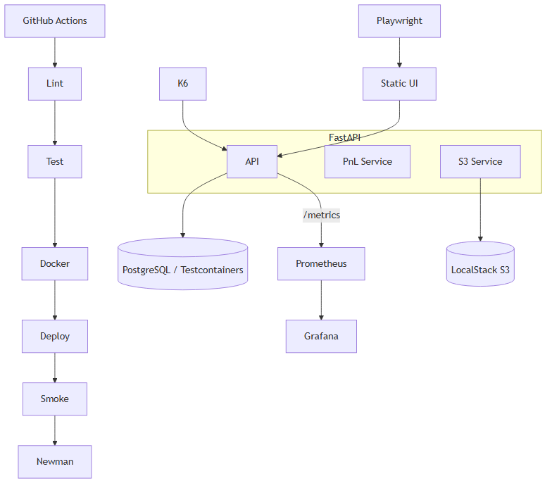

# Stock Portfolio Tracker


FastAPI tabanlı portföy ve işlem takibi: gerçek zamanlı P&L özeti, LocalStack S3 export, Prometheus metrikleri, Playwright E2E ve k6 performans testleri. Statik web arayüzü `/ui` altında Türkçe olarak servis edilir.


## Mimari Genel Bakış

Uygulama; FastAPI (REST + Prometheus metrics), PostgreSQL (üretim) / SQLite (test), LocalStack S3 (export), Prometheus + Grafana (izleme) ve vanilla JavaScript statik UI'dan oluşur. CI, GitHub Actions'da lint→test→docker→smoke→newman sırasıyla çalışır. K8s dağıtımı Minikube hedeflidir.



> PNG yenile: `npx @mermaid-js/mermaid-cli -i docs/architecture.mmd -o docs/architecture.png`

## Kurulum

```bash
# Docker Compose ile tam stack
docker compose up -d
open http://localhost:8000/ui/   # Web UI (Türkçe)
open http://localhost:3000       # Grafana (admin/admin)
open http://localhost:9090       # Prometheus

# Sadece geliştirme
pip install -e ".[dev,e2e]"
uvicorn app.main:app --reload
```

## Test Komutları

```bash
# Unit + Integration (54 test, coverage %84)
pytest --cov=app --cov-fail-under=70

# E2E (backend ayakta olmalı)
playwright install chromium
pytest tests/e2e -v

# Postman / Newman API kontrat testi
newman run postman/stock-portfolio.postman_collection.json \
  -e postman/stock-portfolio.postman_environment.json

# k6 performans testi (p95 < 500ms)
bash scripts/run-perf.sh
```

## K8s (Minikube)

```bash
kubectl apply -f k8s/namespace.yaml
kubectl apply -f k8s/
```

## API Endpoint'leri

| Metot | Yol | Açıklama |
|-------|-----|---------|
| POST | `/portfolios` | Portföy oluştur |
| GET | `/portfolios/{id}` | Portföy + pozisyonlar |
| POST | `/portfolios/{id}/trades` | İşlem ekle (AL/SAT) |
| GET | `/portfolios/{id}/trades` | İşlem listesi |
| GET | `/portfolios/{id}/summary` | P&L özeti |
| POST | `/portfolios/{id}/export` | S3'e JSON export |
| GET | `/health` | Sağlık kontrolü |
| GET | `/metrics` | Prometheus metrikleri |

Detay: [docs/api-contract.md](docs/api-contract.md)

## Rubric Kontrol Listesi (14 madde)

| # | Madde | Durum |
|---|-------|-------|
| 1 | FastAPI mini servisi | ✅ |
| 2 | Pytest + coverage ≥ %70 | ✅ %84 |
| 3 | PostgreSQL + Testcontainers | ✅ |
| 4 | Factory Boy test verisi | ✅ |
| 5 | Multi-stage Docker | ✅ |
| 6 | LocalStack S3 | ✅ |
| 7 | Kubernetes manifestleri | ✅ |
| 8 | GitHub Actions 5 job | ✅ |
| 9 | Postman + Newman | ✅ |
| 10 | Statik Web UI (3+ sayfa) | ✅ Türkçe |
| 11 | Playwright E2E (5+ senaryo) | ✅ 6 senaryo |
| 12 | Prometheus + Grafana (3 panel) | ✅ |
| 13 | k6 performans (p95 < 500ms) | ✅ |
| 14 | README + mimari + final rapor | ✅ |

## Dokümantasyon

- [Mimari](docs/architecture.md)
- [Final Rapor](docs/final-report.md)
- [İş Paylaşımı](docs/work-distribution.md)
- [Demo Senaryosu](docs/demo-script.md)
- [API Sözleşmesi](docs/api-contract.md)

## Lisans

MIT — bkz. [LICENSE](LICENSE).

## Yapay Zeka Kullanımı

UI, dashboard JSON, E2E seçiciler ve dokümantasyon bölümleri yapay zeka yardımıyla taslak oluşturulmuş; tüm metrik adları ve hata kodları `docs/integration.md` ve `docs/api-contract.md` ile doğrulanmıştır.
