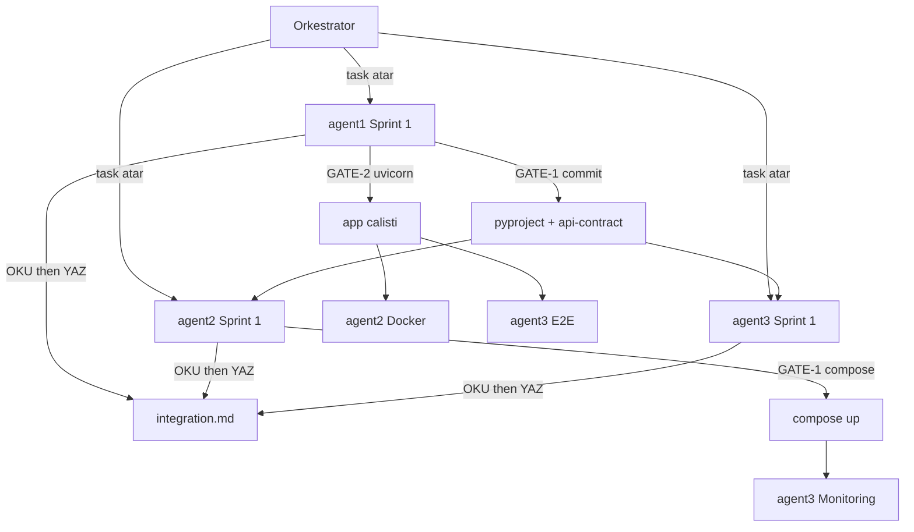

# `docs/` — Orkestratör + 3 Agent yapılandırması

Bu klasör projenin tüm **planlama, koordinasyon ve entegrasyon** dosyalarını içerir. Repo kodu boşken bile bu dosyalar tek başına projenin yol haritasıdır.

## Dosyalar

| Dosya | Sahip | Amaç |
|-------|-------|------|
| [`integration.md`](integration.md) | **Orkestratör** (yazma) + 3 agent (okuma/append) | **Ortak hafıza.** Env, port, endpoint, dosya sahipliği, metric, S3, postman, CI artifact, marker, GATE durumları. Tek gerçek kaynak. |
| [`agent1.md`](agent1.md) | Orkestratör atar, **agent1** uygular | Backend + Test Coverage (Sprint 1-2-3). |
| [`agent2.md`](agent2.md) | Orkestratör atar, **agent2** uygular | Docker + LocalStack + K8s + CI + Newman (Sprint 1-2-3). |
| [`agent3.md`](agent3.md) | Orkestratör atar, **agent3** uygular | UI + Playwright + Prometheus/Grafana + k6 + Belgeler (Sprint 1-2-3). |

## Çalışma akışı (sıkı sıra)

## Protokol özeti

1. **Her agent**, sprint görevine başlamadan ÖNCE `integration.md`’yi **OKUMA PROTOKOLÜ** ile okur.
2. Paylaşılan bir noktaya dokunduğunda `Work Notes`’a **YAZMA PROTOKOLÜ** ile entry ekler.
3. Katalog bölümlerine (A-K) doğrudan editleme **YOK** — sadece `🚨 Bloker` bölümüne yazıp orkestratörden değişiklik talep eder.
4. Sprint sonunda kendi DoD checklist’inde **“integration.md Work Note eklendi”** kalemini işaretler.

Detaylı protokol [`integration.md`](integration.md) üst kısmında.

## GATE’lerin anlamı

| GATE | Anlamı | Açan agent | Bekleyenler |
|------|--------|-------------|--------------|
| agent1 GATE-1 | `pyproject.toml` + `docs/api-contract.md` commit | agent1 | agent2, agent3 |
| agent1 GATE-2 | `uvicorn app.main:app` + tüm endpoint 200 | agent1 | agent2 (Docker build smoke), agent3 (E2E) |
| agent1 GATE-3 | `pytest --cov-fail-under=70` yeşil | agent1 | agent2 (CI test job) |
| agent2 GATE-1 | `docker compose up -d` 3 servis healthy | agent2 | agent3 (monitoring servisleri ekleme) |
| agent2 GATE-2 | Export router canlı, S3 yazıyor | agent2 | (Phase 2 agent1 analysis) |
| agent2 GATE-3 | GitHub Actions 5 job yeşil | agent2 | proje teslimi |
| agent3 GATE-1 | `static/` UI servis ediliyor | agent3 | proje demo |
| agent3 GATE-2 | Playwright 5 senaryo yeşil | agent3 | proje teslimi |
| agent3 GATE-3 | Grafana 3 panel canlı | agent3 | proje teslimi |

## Orkestratör görevleri

- Yeni agent görevi atarken **karşılık gelen md’yi referans gösterir** ("`agent2.md` Görev 1.5’i yap").
- Bir agent `🚨 Bloker` yazdığında **inceler ve katalogu günceller** (kendi YAZMA PROTOKOLÜ ile).
- GATE’ler `[x]` işaretlendiğinde **bağımlı agent’a haber verir**.
- Sprint sonunda `integration.md` Work Notes’u 3 agent için de var olduğunu doğrular; eksikse o agent “Done” sayılmaz.

## Dosya değişiklik geçmişi (özet)

| Tarih | Dosya | Değişiklik |
|-------|-------|------------|
| 2026-05-19 | `agent1.md`, `agent2.md`, `agent3.md` | İlk sürüm — 3 sprint detaylı task. |
| 2026-05-19 | `integration.md` | Tohumlandı (katalog A-K + protokol + Work Notes iskeleti). |
| 2026-05-19 | tüm agent.md dosyaları | integration.md protokol banner’ı + sprint-sonu sync görevi eklendi. |
| 2026-05-19 | `docs/README.md` | Bu dosya. |
