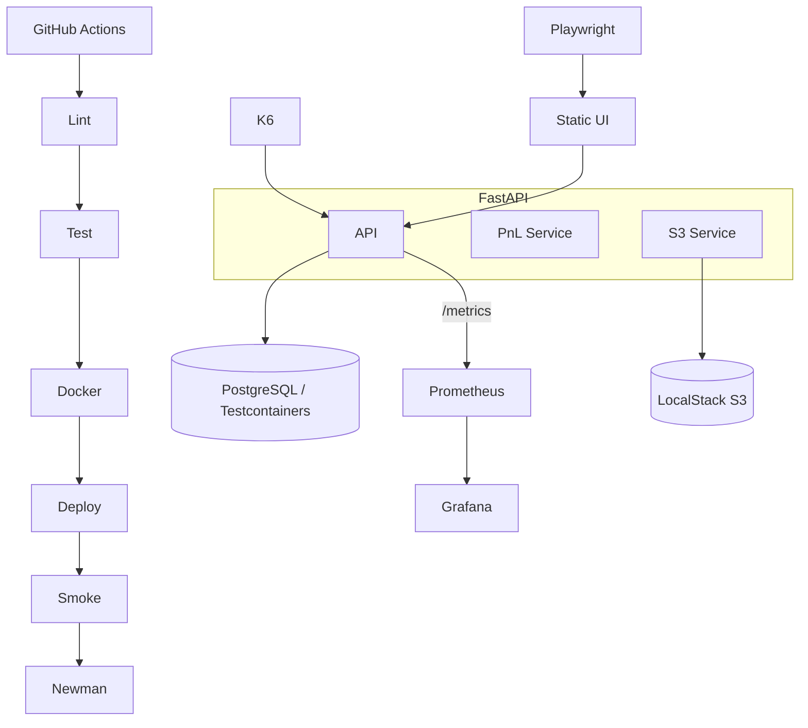

# Architecture — Stock Portfolio Tracker

## Diagram

Export PNG: `npx @mermaid-js/mermaid-cli -i docs/architecture.mmd -o docs/architecture.png`

## Components

### FastAPI application

REST API for portfolios, trades, P&amp;L summary, health, and Prometheus metrics. Chosen for async I/O, automatic OpenAPI docs, and first-class Python typing with Pydantic v2.

### P&amp;L service

Domain logic for average cost, realized/unrealized P&amp;L, and sell validation (`INSUFFICIENT_POSITION`). Keeps routers thin and testable.

### PostgreSQL

Primary persistence in Docker Compose and CI. SQLite in-memory for fast unit tests. Testcontainers validates PostgreSQL-specific behavior.

### LocalStack S3

Cloud-local object storage for portfolio exports and (Phase 2) analysis artifacts without AWS credentials in development.

### Static UI (`/ui`)

Vanilla HTML/JS served by FastAPI `StaticFiles`. No frontend framework — sufficient for demos and Playwright E2E.

### Playwright E2E

Five browser scenarios cover portfolio creation, trades, summary, and error paths via `data-testid` selectors.

### Prometheus + Grafana

`prometheus-fastapi-instrumentator` exposes `http_requests_total` and `http_request_duration_seconds_*`. Grafana dashboard **Portfolio Overview** has three panels: request rate, latency quantiles, error rate.

### k6

Load script ramps VUs, exercises trade + summary endpoints, enforces `p(95) < 500ms` on the summary group.

### GitHub Actions

Pipeline: lint → pytest (+ Playwright when backend present) → Docker build → compose smoke → Newman.

## Data flow: SELL trade without position

1. User submits SELL on `portfolio.html` → `fetch` POST `/portfolios/{id}/trades`.
2. FastAPI router validates body → portfolio service checks position quantity.
3. Service raises `INSUFFICIENT_POSITION` → HTTP 400 with `{detail, code}`.
4. UI shows `data-testid="error-banner"` with error text.
5. Failed request still increments `http_requests_total{status="400"}` → visible in Grafana error/latency panels after scrape.
