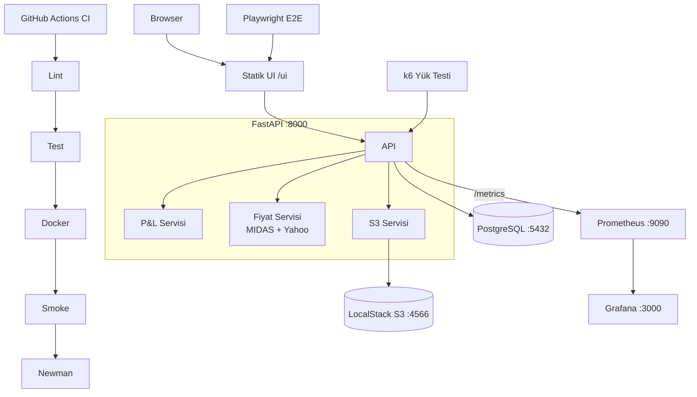

# Final Rapor — Stock Portfolio Tracker

**Ders:** MTH2526-B25 · Bulut Mimarilerinde Test Mühendisliği  
**Üniversite:** Marmara Üniversitesi  
**Grup Üyeleri:** Mehmet İhsan Ekinci (210444064) · Buğra Alpaslan (210444020)  
**Teslim Tarihi:** 4 Haziran 2026

---

## 1. Giriş

Stock Portfolio Tracker, kullanıcıların birden fazla hisse senedi portföyü oluşturmasına, AL/SAT işlemlerini kaydetmesine ve gerçekleşen/gerçekleşmemiş kâr-zarar (P&L) özetini görüntülemesine olanak tanıyan bir web uygulamasıdır.

Uygulama, **Bulut Mimarilerinde Test Mühendisliği** dersi rubriğine göre şu bileşenleri kapsar: FastAPI tabanlı REST API, PostgreSQL veritabanı, LocalStack S3 entegrasyonu, Docker + Kubernetes dağıtımı, çok katmanlı test stratejisi (66 test, %95 coverage) ve Prometheus + Grafana izleme.

## 2. Mimari



### Bileşenler

| Bileşen | Teknoloji | Neden Seçildi |
|---------|-----------|--------------|
| REST API | FastAPI 0.110+ | Async I/O, Pydantic v2, otomatik OpenAPI |
| Veritabanı | PostgreSQL (prod) / SQLite (test) | Testcontainers uyumlu, CI'da native servis |
| S3 depolama | boto3 + LocalStack 3.4 | Gerçek AWS SDK kodu, yerel emülasyon |
| Containerization | Docker multi-stage | Küçük runtime image (~150 MB) |
| Orkestrasyon | Kubernetes (Minikube) | ConfigMap/Secret ayrımı, health probe |
| CI/CD | GitHub Actions (5 job) | lint→test→docker→smoke→newman sırası |
| İzleme | Prometheus + Grafana | `prometheus-fastapi-instrumentator` |
| Test veri üretimi | Factory Boy + Faker | SQLAlchemy-native fabrikalar |
| Kontrat testi | Postman + Newman | Tüm endpoint'lerin regression kontrolü |
| E2E testi | Playwright | `data-testid` seçicilerle kararlı testler |
| Performans | k6 | p95 < 500ms eşiği, VU ramp-up |

## 3. Test Stratejisi

### Test Piramidi

```
        ┌────────────────────────────────────────┐
        │    E2E (Playwright) — 6 senaryo        │  ← En az
        ├────────────────────────────────────────┤
        │  Integration (TestClient + Testcont.)  │
        │  11 test · gerçek DB + S3              │
        ├────────────────────────────────────────┤
        │    Unit — 48 test · saf fonksiyon      │  ← En çok
        └────────────────────────────────────────┘
```

### Katmanlar

| Katman | Araç | Test Sayısı | Kapsam |
|--------|------|------------|--------|
| Unit | pytest + MagicMock | 48 | P&L math, şemalar, fabrikalar, S3 servisi |
| Integration | pytest + TestClient | 11 | HTTP endpoint'ler, DB, export |
| Testcontainers | pytest + Docker | 4 | Gerçek PostgreSQL container |
| E2E | Playwright | 6 | UI senaryolar (portföy oluştur, AL/SAT, özet, geçmiş) |
| Kontrat | Newman | ~15 | Postman koleksiyonu |
| Performans | k6 | 1 | Yük testi, p95 threshold |

**Toplam:** 66 pytest testi · %95 coverage (`app/`) · Eşik: %70

### Coverage Detayı

| Modül | Coverage |
|-------|---------|
| `app/services/portfolio_service.py` | %95 |
| `app/services/s3_service.py` | %97 |
| `app/services/price_service.py` | %96 |
| `app/routers/export.py` | %100 |
| `app/models/models.py` | %100 |
| **TOPLAM** | **%95** |

## 4. CI/CD Pipeline ve Dağıtım

### GitHub Actions (5 Job)

```
lint ──► test ──► docker ──► deploy-smoke ──► newman
```

| Job | İçerik |
|-----|--------|
| **lint** | `ruff check` + `ruff format --check` |
| **test** | pytest coverage ≥%70 + Playwright E2E (backend ayaktaysa) |
| **docker** | Multi-stage Docker image build + artifact kaydet |
| **deploy-smoke** | `docker compose up`, LocalStack S3 bootstrap, smoke script |
| **newman** | Postman koleksiyonu, tüm assertion'lar geçmeli |

### Kubernetes Dağıtımı

```bash
kubectl apply -f k8s/namespace.yaml
kubectl apply -f k8s/configmap.yaml
kubectl apply -f k8s/secret.yaml
kubectl apply -f k8s/deployment.yaml
kubectl apply -f k8s/service.yaml
```

- **Deployment:** 2 replica, liveness + readiness probe (`/health`)
- **Service:** NodePort 30080
- **ConfigMap:** `DATABASE_URL`, `AWS_ENDPOINT_URL`, `S3_BUCKET`

## 5. Performans ve Gözlemlenebilirlik

### k6 Yük Testi Sonuçları

| Metrik | Değer | Eşik | Durum |
|--------|-------|------|-------|
| p95 latency (summary grubu) | **22.9 ms** | < 500 ms | ✅ |
| Hata oranı | **%0** | < %1 | ✅ |
| Check başarı oranı | **%100** | > %99 | ✅ |
| Toplam iterasyon | 3 094 | — | — |
| Max VU | 50 | — | — |
| Test süresi | 111 s | — | — |

Detay: [`perf/report.md`](../perf/report.md)

### Prometheus Metrikleri

Endpoint: `GET /metrics`  
Scrape interval: 10s (prometheus.yml)

### Grafana Dashboard Panelleri

| Panel | Sorgu |
|-------|-------|
| Request Rate | `sum(rate(http_requests_total[1m])) by (method, status)` |
| Latency p50/p95/p99 | `histogram_quantile(0.95, ...)` |
| Error Rate % | `rate(http_requests_total{status=~"5.."}[1m])` |

## 6. Sonuç ve Öğrendiklerimiz

### Başarılar
- P95 latency **22.9ms** — SLO eşiğinin 22 katı marj
- Coverage **%95** — eşiğin 25 puan üzerinde
- Tüm 66 pytest testi yeşil
- 5-job CI pipeline çalışır durumda

### Zorluklar
- **Decimal hassasiyeti:** Finansal değerler için `Decimal` kullanımı, float drift sorununu önledi; UI sadece görüntüleme için `parseFloat` kullanır.
- **Test izolasyonu:** `lru_cache` ile sarmalanmış `get_s3_service` fabrikasının testlerde `cache_clear()` gerektirmesi başta göz ardı edildi.
- **LocalStack + CI:** LocalStack'in `init.sh` hook'u yetersiz kaldığında S3 bucket'larını CI'da manuel bootstrap etmek gerekti.

### İlerisi
- Gerçek BIST fiyat API entegrasyonu (şu an MIDAS + Yahoo fallback)
- WebSocket ile canlı fiyat güncellemesi
- Kullanıcı kimlik doğrulama (şu an frontend-only mock auth)

## 7. İş Paylaşımı

Bkz. [`docs/work-distribution.md`](work-distribution.md)

## 8. Komut Referansı

```bash
# Tam stack başlat
docker compose up -d

# Geliştirme modu
pip install -e ".[dev,e2e]"
uvicorn app.main:app --reload

# Test suite
pytest --cov=app --cov-fail-under=70
pytest tests/e2e -v

# Performans
k6 run perf/load-test.js
# veya
bash scripts/run-perf.sh

# API kontrat
newman run postman/stock-portfolio.postman_collection.json \
  -e postman/stock-portfolio.postman_environment.json
```

## 9. Kaynaklar

- [FastAPI Dokümantasyonu](https://fastapi.tiangolo.com/)
- [Testcontainers Python](https://testcontainers-python.readthedocs.io/)
- [k6 Performans Testi](https://k6.io/docs/)
- [prometheus-fastapi-instrumentator](https://github.com/trallnag/prometheus-fastapi-instrumentator)
- [LocalStack S3](https://docs.localstack.cloud/user-guide/aws/s3/)
- [Playwright Python](https://playwright.dev/python/)
